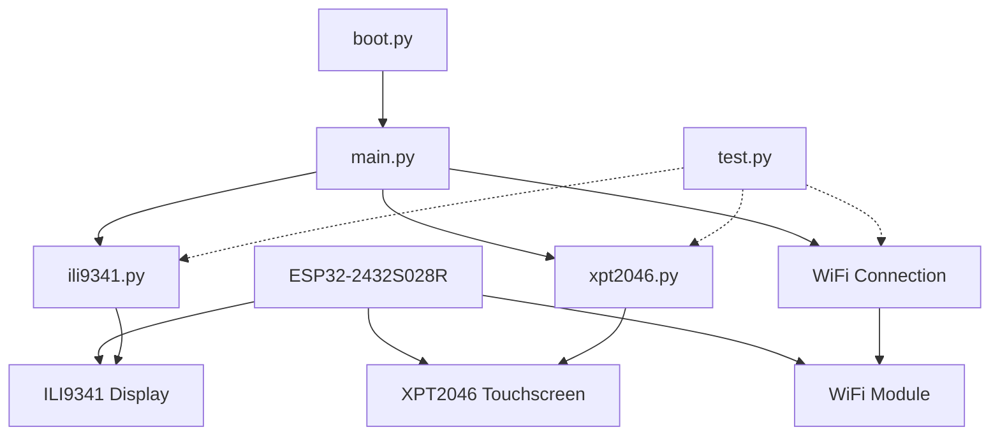
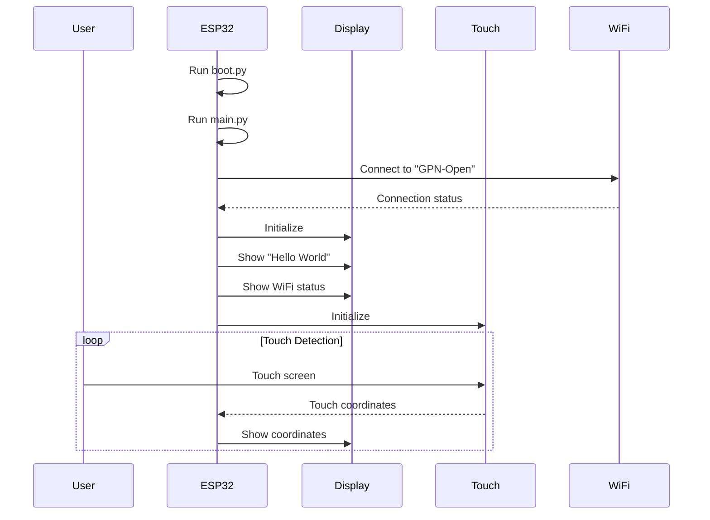

# ESP32-2432S028R Project Structure

This document provides an overview of the project structure and how the components interact with each other.

## File Structure

```
ESP32-2432S028R/
├── boot.py              # Runs on startup, initializes system
├── main.py              # Main application code
├── ili9341.py           # Display driver
├── xpt2046.py           # Touchscreen driver
├── test.py              # Test utilities
├── pymakr.conf          # Pymakr configuration
├── README.md            # Project documentation
├── INSTALL.md           # Installation guide
└── PROJECT_STRUCTURE.md # This file
```

## Component Diagram



## Data Flow



## Pin Connections

### Display (ILI9341)

```
ESP32 Pin | ILI9341 Pin | Function
----------|-------------|----------
GPIO14    | SCK         | Clock
GPIO13    | MOSI        | Data Out
GPIO12    | MISO        | Data In
GPIO15    | CS          | Chip Select
GPIO2     | DC          | Data/Command
GPIO4     | RST         | Reset
GPIO21    | BL          | Backlight
```

### Touchscreen (XPT2046)

```
ESP32 Pin | XPT2046 Pin | Function
----------|-------------|----------
GPIO25    | SCK         | Clock
GPIO33    | MOSI        | Data Out
GPIO32    | MISO        | Data In
GPIO26    | CS          | Chip Select
```

## Software Components

### boot.py
- Initializes the system
- Sets CPU frequency
- Manages memory

### main.py
- Connects to WiFi
- Initializes display and touchscreen
- Displays "Hello World"
- Shows WiFi connection status
- Handles touch events and displays coordinates

### ili9341.py
- Driver for ILI9341 display
- Provides drawing functions (text, shapes, etc.)
- Manages display buffer

### xpt2046.py
- Driver for XPT2046 touchscreen
- Detects touch events
- Provides touch coordinates
- Handles calibration

### test.py
- Provides test functions for display, touchscreen, and WiFi
- Helps with debugging and verification

## Execution Flow

1. ESP32 boots and runs boot.py
2. boot.py initializes system and then runs main.py
3. main.py connects to WiFi network "GPN-Open"
4. main.py initializes the display and shows "Hello World"
5. main.py shows WiFi connection status
6. main.py initializes the touchscreen
7. When the screen is touched, main.py displays the touch coordinates
